# ⚽ SoccerTraining App

**SoccerTraining** es una aplicación móvil desarrollada con **React Native (Expo)** que permite a jugadores, entrenadores y aficionados al fútbol llevar un control completo de su entrenamiento, progreso físico, nutrición y desarrollo técnico.  
El objetivo es ofrecer una plataforma moderna e intuitiva que motive al usuario a mejorar su rendimiento deportivo día a día.

---

## 🖼️ Capturas de pantalla

A continuación se muestran algunas vistas actuales de la app:

<p align="center">
  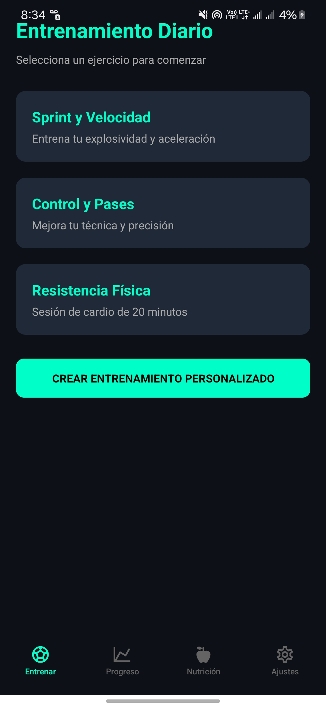
  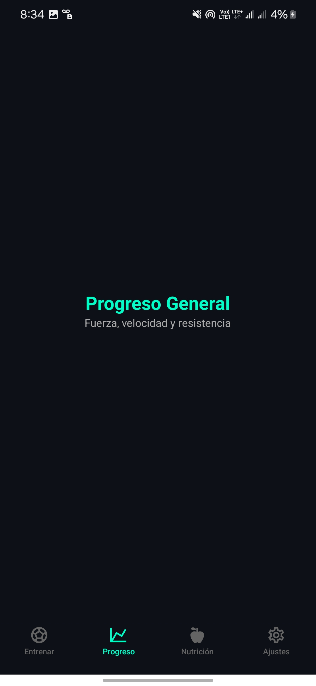
  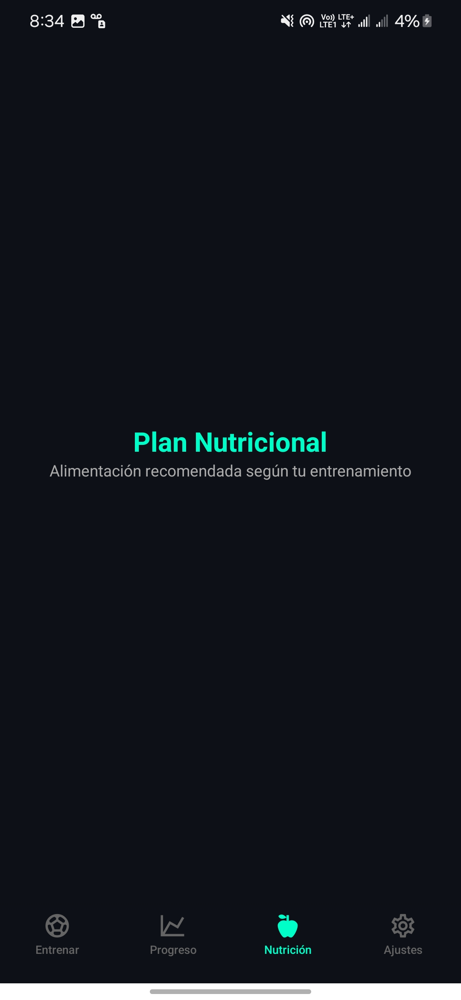
  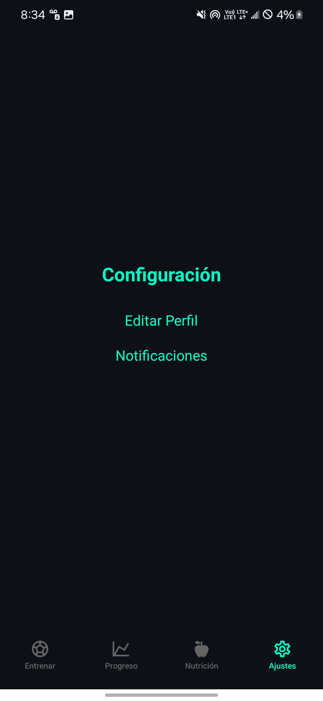
  
  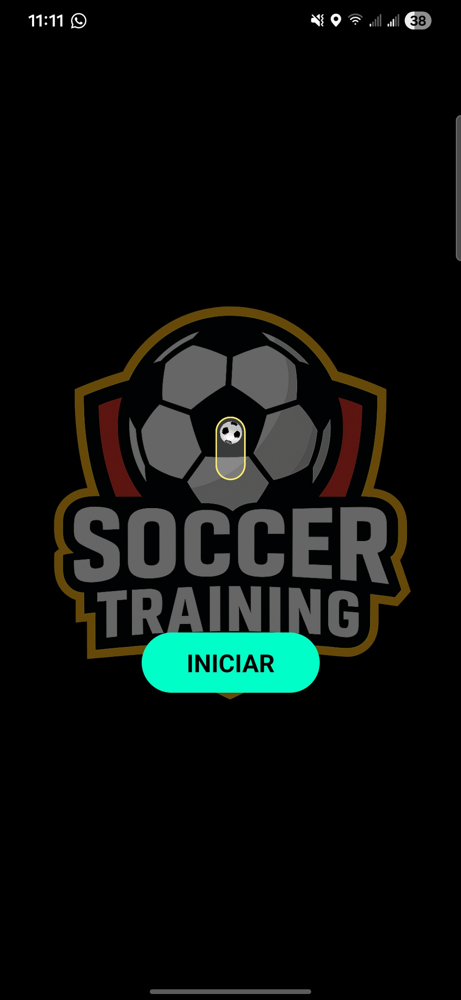
  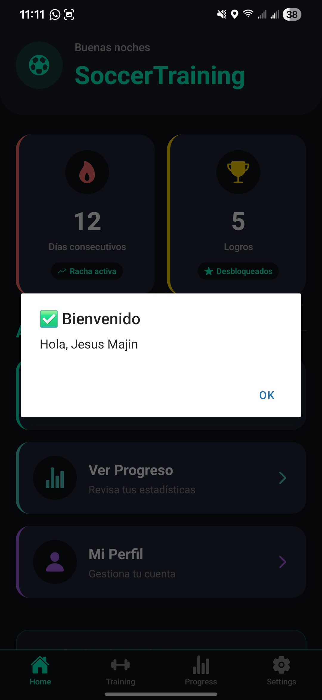
  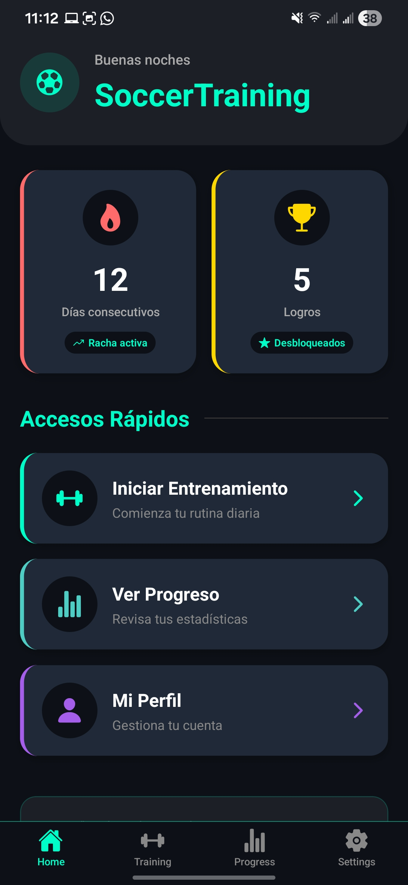
  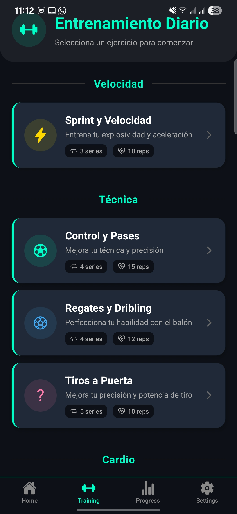
  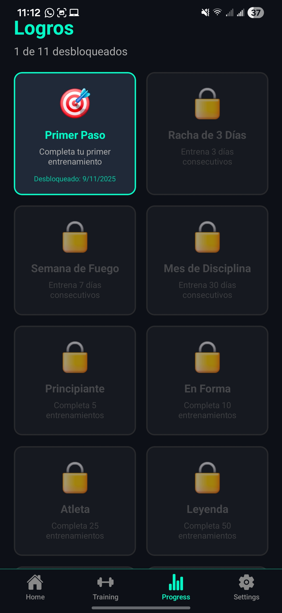
  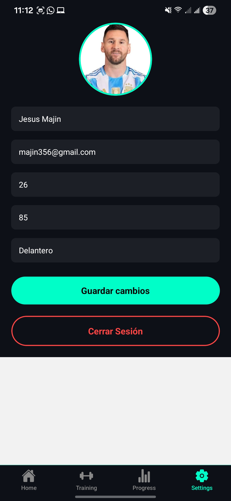
  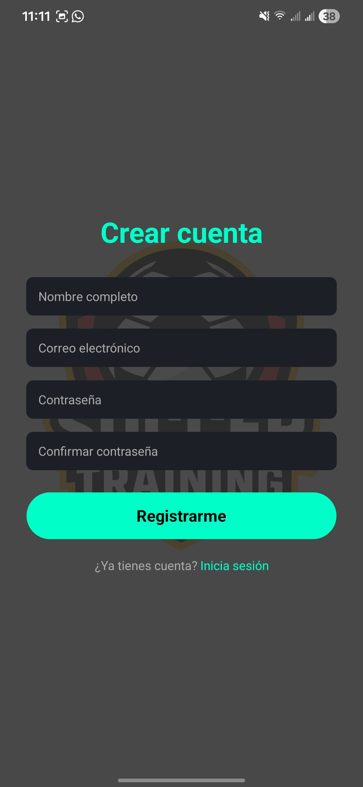
  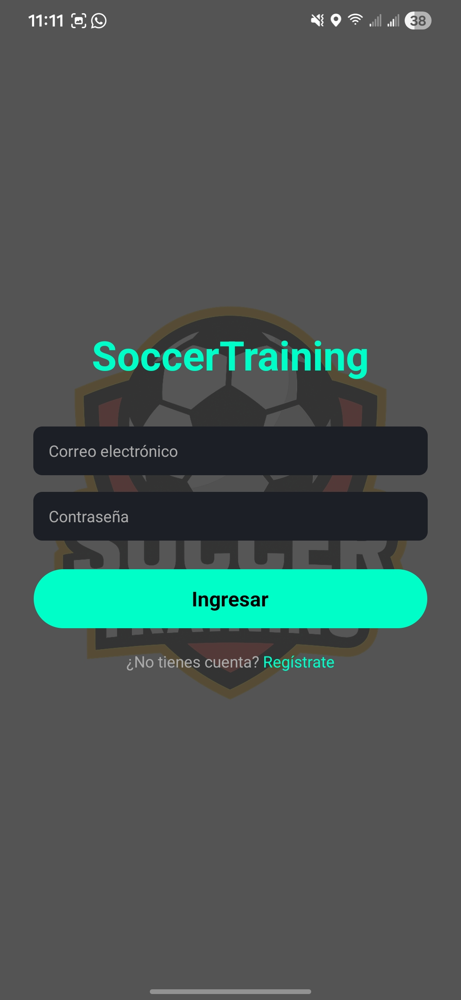
</p>

> 💬 Estas imágenes corresponden a la versión actual en desarrollo de **SoccerTraining**.

## 🚀 Tecnologías principales

- **React Native** (Expo SDK)
- **React Navigation v6**
- **Lottie Animations** (para animaciones del logo y pantallas intro)
- **Expo Vector Icons**
- **JavaScript (ES6+)**
- **Expo Go** para ejecución y pruebas en dispositivos reales
- **Yarn** como manejador de dependencias

---

## 🧭 Estructura general del proyecto

```plaintext
SoccerTraining/
├── App.js
├── app.json
├── package.json
├── assets/
│   ├── images/
│   │   └── bg-stadium.png
│   └── animations/
│       └── logo.json
├── src/
│   ├── navigations/
│   │   ├── AppNavigation.js
│   │   ├── HandlerNavigation.js
│   │   ├── stacks/
│   │   │   ├── AuthNavigation.js
│   │   │   ├── TrainingNavigation.js
│   │   │   ├── ProgressNavigation.js
│   │   │   ├── NutritionNavigation.js
│   │   │   └── SettingsNavigation.js
│   │   └── BottomTabNavigation/
│   │       └── BottomTabNavigation.js
│   ├── screens/
│   │   ├── Auth/
│   │   │   ├── AuthStartScreen.js
│   │   │   ├── LoginScreen.js
│   │   │   └── RegisterScreen.js
│   │   ├── Training/
│   │   │   ├── TrainingDashboardScreen.js
│   │   │   ├── ExerciseDetailScreen.js
│   │   │   └── CustomTrainingScreen.js
│   │   ├── Progress/
│   │   │   ├── ProgressOverviewScreen.js
│   │   │   ├── HistoryScreen.js
│   │   │   └── AchievementsScreen.js
│   │   ├── Nutrition/
│   │   │   ├── NutritionDashboardScreen.js
│   │   │   ├── HydrationScreen.js
│   │   │   └── SupplementsScreen.js
│   │   ├── Settings/
│   │   │   ├── SettingsScreen.js
│   │   │   ├── EditProfileScreen.js
│   │   │   └── NotificationsScreen.js
│   │   └── Global/
│   │       ├── CameraScreen.js
│   │       ├── UserProfileScreen.js
│   │       └── ImageFullScreen.js
│   └── utils/
│       └── screens.js
└── README.md
🏁 Flujo principal de la aplicación
🔹 Pantalla inicial (Intro Animada)
Animación del logo (logo.json) con LottieView

Fondo de estadio (bg-stadium.png)

Botón “INICIAR” que redirige al flujo de autenticación

🔹 Autenticación
AuthStartScreen.js → pantalla de bienvenida animada

LoginScreen.js → inicio de sesión

RegisterScreen.js → registro de nuevos usuarios

🔹 Navegación principal (BottomTabNavigation)
Una vez autenticado, el usuario accede al menú principal con 4 secciones:

Sección	Descripción
⚽ Entrenar	Rutinas, ejercicios, y entrenamientos personalizados
📊 Progreso	Historial de rendimiento, gráficas y logros
🥗 Nutrición	Planes alimenticios, hidratación y suplementos
⚙️ Ajustes	Configuración, perfil y notificaciones

Cada módulo cuenta con su propio stack navigator para mantener independencia y escalabilidad.

🎨 Diseño y experiencia de usuario
Estilo moderno tipo videojuego, fondo oscuro e interfaz deportiva.

Tipografías limpias, botones redondeados y navegación fluida.

Uso de LottieView para crear animaciones de alto impacto visual.

Compatibilidad con Expo Go en Android e iOS.

🧰 Scripts disponibles
En el archivo package.json:

json
Copiar código
"scripts": {
  "dev": "expo start --tunnel -c",
  "start": "expo start",
  "android": "expo run:android",
  "ios": "expo run:ios",
  "web": "expo start --web"
}
🔹 Comandos comunes
Comando	Descripción
yarn dev	Inicia el servidor Expo con túnel y caché limpia
yarn start	Inicia el servidor Expo estándar
yarn android	Compila la app para Android
yarn ios	Compila la app para iOS
yarn web	Ejecuta la app en navegador web

⚙️ Dependencias principales
bash
Copiar código
expo install react-native-screens react-native-safe-area-context
yarn add @react-navigation/native @react-navigation/native-stack @react-navigation/bottom-tabs
yarn add lottie-react-native
yarn add react-native-vector-icons
💡 Próximas características planificadas
Módulo	Funcionalidad
🧠 Entrenamientos IA	Recomendación automática de rutinas según el progreso del usuario
🗓️ Calendario deportivo	Seguimiento de entrenamientos, descansos y torneos
☁️ Sincronización en la nube	Integración con Firebase o Supabase
📸 Análisis de movimiento	Detección de técnica mediante cámara del dispositivo
🧾 Reportes PDF	Exportar informes de progreso personalizados
👥 Modo entrenador	Control de equipos, jugadores y estadísticas grupales
🔔 Notificaciones push	Recordatorios automáticos de entrenamiento o nutrición

🧑‍💻 Desarrollador
Autor: Jesús Majín
📧 Email: majin356@gmail.com
💼 Rol: Full Stack / Mobile Developer
📱 Proyecto personal de mejora deportiva con visión profesional.

🧾 Licencia
Este proyecto se distribuye bajo la licencia MIT, lo que permite su uso, modificación y distribución libre con atribución.

🏆 Objetivo general
Crear una aplicación integral que combine entrenamiento, progreso físico, nutrición y análisis deportivo en una sola herramienta accesible, moderna y adaptable para futbolistas de todos los niveles.

💬 Contribuciones
¿Quieres colaborar en el desarrollo de SoccerTraining?

Haz un fork del repositorio.

Crea una nueva rama:

bash
Copiar código
git checkout -b feature/nueva-funcionalidad
Haz tus cambios y súbelos:

bash
Copiar código
git commit -m "Agregada nueva funcionalidad"
git push origin feature/nueva-funcionalidad
Envía un Pull Request.

📸 Vista previa (en desarrollo)
🖼️ Pantalla de inicio animada con logo Lottie

⚽ Fondo dinámico de estadio (bg-stadium.png)

🧭 Barra inferior de navegación con íconos temáticos

📊 Visualización de progreso (en construcción)
